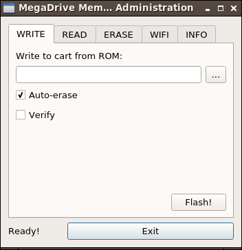

# mw-mdma-cli
MegaWiFi MegaDrive Memory Administration (MDMA) interface. This program allows to read and write ROMs from/to MegaWiFi cartridges, using a MegaWiFi programmer. It also allows to upload firmware blobs to the in-cart ESP8266 WiFi module. Starting with version 0.4, the program can also be built with a nice Qt5 GUI (in addition to the command-line interface).

# Installing
Pre-built versions for 64-bit Windows 7 (or later), can be found under [bin/release/windows](bin/release/windows) directory. Extract the archive and use the `mdma.exe` program. Note that in Windows you will also need to install the libusb drivers. An easy way to install them under Windows is using [Zadig](http://zadig.akeo.ie/).

# Building
Instead of installing the pre-built versions, you can build them yourself. It is possible to build the binary without Qt support (with only the CLI mode available) or with Qt support (both CLI and GUI modes available). The build process has been tested for Linux and Windows. It should also work with macOS, but I have no way of testing it. If you give it a try under macOS, please drop me a line about the process.

## Basic CLI
For the basic CLI version, you just need to install `libusb-1.0` development packages and the standard development tools. then cd to the path with the sources and call:
```
$ make -f Makefile-no-qt
```
If everything goes OK, you should have the `mdma` binary sitting in the same directory.

## Full-featured GUI + CLI
If you want to be able to launch the Qt GUI (in addition to being able to use the program in CLI mode), you will have to install the `qt5-base` development packages (`qt5-default` in Ubuntu and derivatives). Then run:
```
$ qt5-qmake
$ make
```
If the build process completes successfully, you should be able to run `mdma -Q` to start the GUI.

# Usage
Once you have plugged a MegaWiFi cartridge into a MegaWiFi Programmer (and have installed the driver if using Windows), you can use mdma. You will have to choose between using the Command Line Interface (CLI) or the Graphical User Interface (GUI).

## Using the MDMA GUI

To start the MDMA GUI run the program with the `-Q` switch:
```
$ mdma -Q
```
This should start the GUI. If the programmer is plugged and drivers are OK, you should be greeted by a screen like this:



Usage should be self-explanatory, just use the `WRITE` tab to burn ROMs to the cart, the `READ` tab to read ROMs from the cart, the `ERASE` tab to erase the cartridge contents, the `WIFI` tab to upload firmware blobs to the WiFi module (currently supported only in CLI mode), and the `INFO` tab to query cartridge and programmer info, and to enter bootloader mode.

If you will be frequently using the MDMA GUI, it is recommended to create a shortcut invoking `mdma -Q`.

## Using the MDMA CLI

 The command line application invocation is as follows:
```
$ mdma [option1 [option1_arg]] […] [optionN [optionN_arg]]
```
The options (option1 ~ optionN) can be any combination of the ones listed below. Options must support short and long formats. Depending on the used option, and option argument (option\_arg) must be supplied. Several options can be used on the same command, as long as the combination makes sense (e.g. it does make sense using the flash and verify options together, but using the help option with the flash option doesn't make too much sense).

| Option | Argument type | Description |
|---|---|---|
| --qt-gui, -Q | N/A | Use the Qt GUI (if supported). |
| --flash, -f | R - File | Programs the contents of a file to the cartridge flash chip. |
| --read, -r | R - File | Read the flash chip, storing contents on a file. |
| --erase, -e | N/A | Erase entire flash chip. |
| --sect-erase, -s | R - Address | Erase flash sector corresponding to address argument. |
| --range-erase, -A | R - File | Erase flash memory range. |
| --auto-erase, -a | N/A | Auto-erase (use it with flash command). |
| --verify, -V | N/A | Verify written file after a flash operation. |
| --flash-id, -i | N/A | Print information about the flash chip installed on the cart. |
| --pushbutton, -p | N/A | Read programmer pushbutton status. |
| --gpio-ctrl, -g | R - Pin data | Manually control GPIO port pins of the microcontroller. |
| --wifi-flash, -w | R - File | Uploads a firmware blob to the cartridge WiFi module. |
| --wifi-mode, -m | R - Mode | Set WiFi module flash chip mode (qio, qout, dio, dout). |
| --bootloader, -b | N/A | Enters DFU bootloader mode, to update programmer firmware. |
| --dry-run, -d | N/A | Performs a dry run (parses command line but does nothing). |
| --version, -R | N/A | Print version information and exit. |
| --verbose, -v | N/A | Write additional information on console while performing actions. |
| --help, -h | N/A | Print a brief help screen and exit. |

The Argument type column contains information about the parameters associated with every option. If the option takes no arguments, it is indicated by “N/A” string. If the option takes a required argument, the argument type is prefixed with “R” character. Supported argument types are File, Address and Pin Data:
* File: Specifies a file name. Along with the file name, optional address and length fields can be added, separated by the colon (:) character, resulting in the following format:
file\_name[:address[:length]]
* Address: Specifies an address related to the command (e.g. the address to which to flash a cartridge ROM or WiFi firmware blob).
* Pin Data: Data related to the read/write operation of the port pins, with the format:
pin\_mask:read\_write[:value]

When using Pin Data arguments, each of the 3 possible parameters takes 6 bytes: one for each 8-bit port on the chip from PA to PF. Each of the arguments corresponds to the row with the same name on table 3. The value parameter is only required when writing to any pin on the ports. It is recommended to specify each parameter using hexadecimal values (using the prefix '0x').

The --pushbutton switch returns pushbutton status on the program exit code (so it is easily readable for programs/scripts using mdma-cli. The returned code uses the two least significant bits:
* BIT0: pushbutton status. The pushbutton is pressed if this bit is set.
* BIT1: pushbutton event. If this bit is set, there has been an event (button press and/or release) since the last mdma-cli invocaton. Note this bit is reset each time the program is launched with the --pushbutton switch.

E.g. if the button is pressed, and keeps being pressed when the program evaluates the --pushbutton function, the returned code will be 0x03 (pushbutton event + button pressed). If immediately called before the button is released, returned code will be 0x01 (no event + button pressed). If the button is released and then the program is called again, returned code will be 0x02 (pushbutton event + no button pressed).

Some more examples of the command invocation and its arguments are:
* `$ mdma -ef rom_file` → Erases entire cartridge and flashes rom\_file.
* `$ mdma -af rom_file` → Auto erases the cartridge range used by the rom\_file, and flashes it to the cart.
* `$ mdma --erase -f rom_file:0x100000` → Erases entire cartridge and flashes contents of rom\_file, starting at address 0x100000.
* `$ mdma -s 0x100000` → Erases flash sector containing 0x100000 address.
* `$ mdma -Vf rom_file:0x100000:32768` → Flashes 32 KiB of rom\_file to address 0x100000, and verifies the operation.
* `$ mdma --read rom_file::1048576` → Reads 1 MiB of the cartridge flash, and writes it to rom\_file. Note that if you want to specify length but do not want to specify address, you have to use two colon characters before length. This way, missing address argument is interpreted as 0.
* `$ mdma -g 0xFF00FFFF0000:0x110000000000:0x000012340000` → Reads data on port A, and writes 0x1234 on ports PC and PD.
* `$ mdma -w wifi-firm.bin:0x10000` → Uploads wifi-firm.bin firmware blob to the WiFi module, at address 0x10000.
* `$ mdma -w bootloader.bin -m qio` → Uploads bootloader.bin firmware blob to the WiFi module at address 0, and sets SPI flash mode to QIO.

# Authors
This program has been written by Migue/Manveru and doragasu.

# Contributions
Contributions are welcome. If you find a bug please open an issue, and if you have implemented a cool feature/improvement, please send a pull request.

# License
This program is provided with NO WARRANTY, under the [GPLv3 license](https://www.gnu.org/licenses/gpl-3.0.html).
